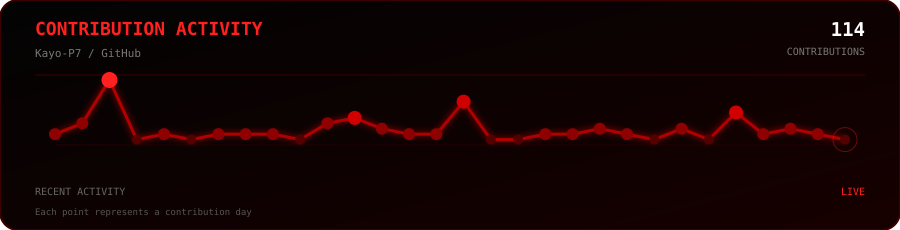

# Hi there, I'm Kayo Albuquerque 👋

 

 

 

  

  

 

---

## 👨‍💻 About Me

I am a **Computer Science** student (4th Semester) focused on modern **Java Backend Development** and the **Spring Ecosystem**. 

I enjoy architecting software that solves business problems using solid **Object-Oriented Programming (OOP)**, Layered Architecture, DTO design patterns, dynamic exception handling, and relational database management.

* 📍 **Location:** Belém, Pará — Brazil
* 🎯 **Career Focus:** Java Backend Internship & Entry-Level Developer roles
* ⚡ **Core Mindset:** Clean Code, Continuous Learning, and Production-Ready Practices

---

## 🚀 Key Projects

### 🔹 [Business Platform API](https://github.com/Kayo-P7/business-platform-api)
> **Stack:** `Java` • `Spring Boot` • `Spring Security` • `Spring Data JPA` • `PostgreSQL`

* Developed a robust RESTful backend service for business management and operations.
* Implemented layered architecture (Controller, Service, Repository), secure authentication workflows, DTO encapsulation, and custom exception handling.
* Integrated dynamic database queries and relational persistence mapping with Spring Data JPA.

### 🔹 [Inventory Management System](https://github.com/Kayo-P7)
> **Stack:** `Java` • `OOP` • `SQL` • `MySQL` • `JDBC`

* Built a backend inventory control solution handling stock movements, product categorization, and record updates.
* Focused on data integrity, transaction safety, and raw/ORM SQL optimization for fast database access.

### 🔹 [Linux System Automation Scripts](https://github.com/Kayo-P7)
> **Stack:** `Linux` • `Bash` • `Shell Script`

* Created automated Bash utility scripts for server maintenance, permission management, and file processing tasks.
* Demonstrates practical OS environment knowledge and command-line automation efficiency.

---

## 🧰 Tech Stack

### **Languages & Core**

### **Frameworks & Database**

### **Tools & Environment**

---

## 📚 Active Learning Focus

* 🔒 Advanced **Spring Security** & Stateless JWT Authentication
* 🧪 Automated Testing using **JUnit 5** & **Mockito**
* 🏗️ **SOLID** principles, Clean Architecture & Microservices Basics

---

Designed & Maintained by <a href="https://github.com/Kayo-P7">Kayo Albuquerque</a>

